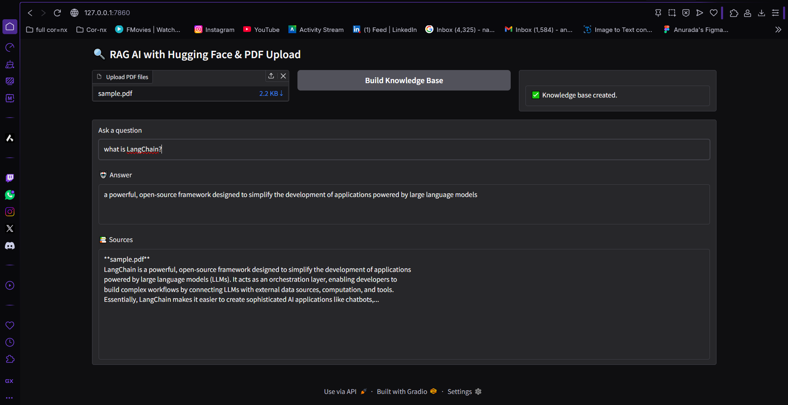

# Retrieval-Augmented Generation (RAG) AI System with LangChain & Hugging Face
This is an End-to-End Retrieval-Augmented Generation (RAG) AI System using LangChain for RAG framework, FAISS for vector store, Hugging Face model as LLM and Gradio for frontend UI. RAG is a framework that improves LLMs by retrieving relevant documents before generating an answer. It ingest documents, retrieve similar documents to the ones queried, and the retrieved documents are passed to an LLM to generate an answer.

## FrontEnd Preview


## Requirements
1. Hugging Face Transformers:   Local LLM for generation
2. LangChain:                   Framework for RAG pipeline
3. FAISS:                       Vector Store
4. PyTorch:                     Python package for Deep Learning and GPU-accelerated tensor computations
5. pymupdf:                  PDF Support
6. sentence-transformers:       For word embeddings
7. Gradio:                      For Web UI


## Set up Environment

### Install system packages (if needed) & Create Virtual Environment
Some Python packages are still catching up with full compatibility for Python3.12 (latest). You may have to use a previous version of Python like 3.10.

#### With Latest Python version 3.12
```sh
sudo apt update
sudo apt install python3 python3-venv python3-pip -y
python3 -m venv venv
source venv/bin/activate
```

#### With Python version 3.10
```sh
sudo apt update
sudo apt install python3.10 python3.10-venv python3.10-pip -y
python3.10 -m venv rag_env
source rag_env/bin/activate
```

### Install the Required Packages
```sh
pip install -r requirements.txt 
```
Note: If langchain gives you issues, install or upgrade the langchain cli with command
```sh
pip install langchain-cli
pip install -U langchain-huggingface
langchain upgrade
```


## Set up config.py to Load the LLM Model
Add script to the config.py file
You don't have GPU, use llm model like: "google/flan-t5-base" (lightweight and CPU-friendly)


## Build the PDF Ingest Script
This script reads PDFs from uploaded_pdfs directory, chunks them, embeds them, and stores them in a FAISS vectorstore. 


## Sample Test PDF 
Add a sample pdf file (any article or tech doc) in the uploaded_pdfs directory or create a sample pdf with the script below


### Run the Script
```sh
python sample.py
```

### Run the Document Ingestion Script
```sh
python ingest.py
```

## Build the Gradio App
This script provides a Web UI to upload PDFs and interact with the RAG system


### Run the Gradio App
```sh
python app.py
```
On your browser:
```sh
localhost:7860
```

On Gradio UI, 
1. Upload pdf file
2. Click "Build Knowledge Base" and 
3. Ask a question e.g. 
        What is LangChain?
        What are some features of LangChain?
        How does LangChain build apps?
Press Enter


